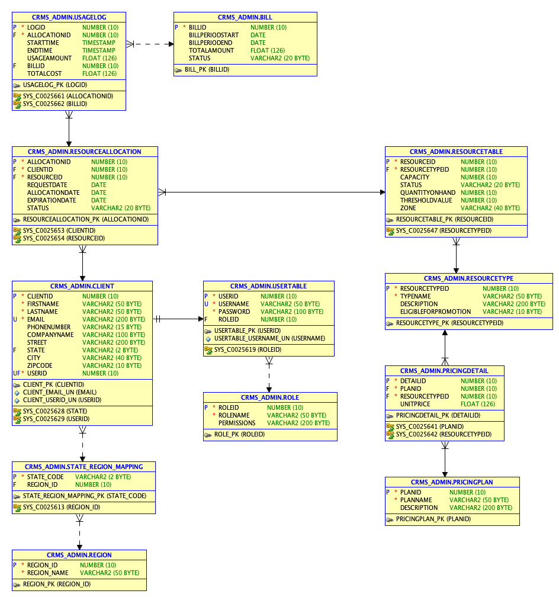

# Cloud Resource Management System (CRMS) Setup Instructions

This README provides a step-by-step guide to setting up the CRMS application by executing a series of SQL scripts in the correct sequence. Each script is designed for a specific purpose, from creating the admin user to defining tables, granting user privileges, populating data, and creating views.

## Prerequisites
- Ensure that you have access to an Oracle SQL environment where you can execute these scripts.
- Confirm that you have the necessary permissions to create users and assign privileges.
- It’s recommended to run each script independently and verify successful execution before proceeding to the next step.

## Script Execution Order

### 1. **Script 1: Admin User Creation**
   - **Purpose**: This script creates the admin user for the CRMS application and grants all necessary privileges.
   - **Instructions**: Run this script first. Upon successful execution, connect to the database as the newly created admin user to continue with subsequent scripts.

### 2. **Script 2: DDL - Table Creation**
   - **Purpose**: This script creates all tables required for the CRMS application.
   - **Instructions**: After connecting as the admin user, run this script to execute the DDL commands, which define the schema, tables, and constraints.

### 3. **Script 3: User Creation and Grants**
   - **Purpose**: This script creates additional users for the CRMS application (such as client, resource manager, regional manager, etc.) and grants them the necessary privileges to access specific tables and perform their designated roles.
   - **Instructions**: Execute this script after successfully creating the tables with Script 2. Ensure that each user is created with appropriate permissions to interact with the database as intended.

### 4. **Script 4: DML - Data Insertion**
   - **Purpose**: This script inserts sample data into the tables created in Script 2.
   - **Instructions**: Run this script after setting up users and grants with Script 3. This step is essential for testing the functionality and ensuring that data is available for view queries.

### 5. **Script 5: Views Creation**
   - **Purpose**: This script creates various views in the CRMS application. The views are designed to provide insights into client billing, regional distribution of clients, resource usage, overdue bills, and more.
   - **Instructions**: Execute this final script after completing data insertion with Script 4. The views rely on populated data for meaningful results, so it’s crucial to run this script last.

## Views

### 1. **`Client_Bill_View`**
   - **Purpose**: Provides detailed billing information for each client.
   - **Columns**:
     - Client details: `CLIENTID`, `FIRSTNAME`, `LASTNAME`, `EMAIL`, `PHONENUMBER`, `COMPANYNAME`, `STREET`, `CITY`, `STATE`, `ZIPCODE`
     - Billing details: `BILLID`, `BILLPERIODSTART`, `BILLPERIODEND`, `TOTALAMOUNT`, `STATUS`
   - **Use**: Allows quick access to both client and billing details in a single view, making it easier to review billing history for each client.

### 2. **`Region_Client_Count`**
   - **Purpose**: Shows the number of clients in each region.
   - **Columns**:
     - `REGION_ID`, `REGION_NAME`, `CLIENT_COUNT` (count of clients per region)
   - **Use**: Useful for understanding the distribution of clients across different regions, which can help in resource allocation and regional planning.

### 3. **`Resource_Client_Count`**
   - **Purpose**: Displays the number of unique clients using each type of resource.
   - **Columns**:
     - `RESOURCETYPEID`, `TYPENAME`, `CLIENT_COUNT` (distinct count of clients using each resource type)
   - **Use**: Helps in identifying the popularity and demand of each resource type, which can inform resource management and capacity planning.

### 4. **`Billing_Summary_By_Region`**
   - **Purpose**: Summarizes the total billing amount for clients in each region.
   - **Columns**:
     - `REGION_ID`, `REGION_NAME`, `TOTAL_BILLING_AMOUNT` (total amount billed per region)
   - **Use**: Useful for financial analysis to see which regions are generating the most revenue, supporting budgeting and investment decisions.

### 5. **`Resource_Usage_Summary`**
   - **Purpose**: Summarizes the total usage amount and total cost for each resource type.
   - **Columns**:
     - `RESOURCETYPEID`, `TYPENAME`, `TOTAL_USAGE_AMOUNT` (sum of usage), `TOTAL_USAGE_COST` (sum of total cost)
   - **Use**: Provides insights into resource consumption and cost, helping in pricing strategies, budgeting, and resource optimization.

### 6. **`Overdue_Bills`**
   - **Purpose**: Lists all bills that are overdue (unpaid with a bill period that has ended).
   - **Columns**:
     - `BILLID`, `CLIENTID`, `CLIENT_NAME` (first and last name combined), `BILLPERIODEND`, `TOTALAMOUNT`, `STATUS`
   - **Use**: Useful for accounts receivable teams to identify overdue payments and follow up with clients for collections.

### 7. **`Active_Resource_Allocations`**
   - **Purpose**: Shows currently active resource allocations.
   - **Columns**:
     - `ALLOCATIONID`, `CLIENTID`, `CLIENT_NAME`, `RESOURCEID`, `RESOURCE_STATUS`, `ALLOCATIONDATE`, `EXPIRATIONDATE`
   - **Use**: Helps track which resources are actively allocated to clients, making it easier for resource managers to monitor usage and renew allocations.

### 8. **`Client_Resource_Allocation_History`**
   - **Purpose**: Provides a historical view of resource allocations for each client.
   - **Columns**:
     - `CLIENTID`, `CLIENT_NAME`, `RESOURCEID`, `ALLOCATIONDATE`, `EXPIRATIONDATE`, `STATUS`
   - **Use**: Useful for auditing and reviewing the history of each client’s resource allocations, enabling trend analysis and historical insights.

### 9. **`Client_Pricing_Plan_View`**
   - **Purpose**: Shows each client along with their chosen pricing plan.
   - **Columns**:
     - Client details: `CLIENTID`, `FIRSTNAME`, `LASTNAME`, `EMAIL`, `PHONENUMBER`, `COMPANYNAME`, `CITY`, `STATE`
     - Pricing plan details: `PLANID`, `PLANNAME`, `DESCRIPTION`
   - **Use**: Useful for understanding client segmentation based on their selected pricing plans, supporting targeted marketing, billing, and personalized offerings.

## ER Diagram
  
